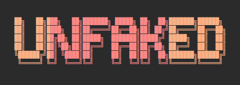

# Unfaked

  <strong>Backend of the Unfaked application</strong> 

  
  
  
  
  

  

---

## Introduction

Today, the world is facing a new kind of war.  
Not a nuclear war. Not a biological war.  
But a war against fake news, misinformation, and deepfakes.

Truth is no longer obvious. Images can lie. Videos can deceive. Audio can be forged.  
Information spreads faster than verification, and misinformation shapes opinions before facts have time to surface.

Unfaked was created in response to this reality.

Built by the **PoopOverflow team**, Unfaked is an application designed to help restore trust in information.  
It allows users to verify **news, images, videos, and audio content** quickly, helping distinguish what is real from
what is manipulated.

Deepfakes have risen.  
Unfaked rises in response.

It is time for truth to shine.

---

## Infrastructure & Architecture Foundation

Unfaked is built on top of **ar-infra-template**, a production-ready Spring Boot infrastructure and architecture
template designed by **Abegà Razafindratelo**.

The template provides a solid, standardized backend foundation, allowing the Unfaked project to focus on its mission
rather than infrastructure concerns.

Repository:  
[https://github.com/Abega1642/ar-infra-template.git](https://github.com/Abega1642/ar-infra-template.git)

---

  Designed & maintained by <a href="https://github.com/Abega1642">Abegà Razafindratelo</a>

